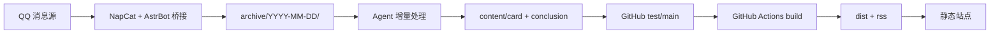

网站 UI 设计基于 @Sallyn0225 的 [gemini-rss-app](https://github.com/Sallyn0225/gemini-rss-app)，谢谢佬的无私开源！

# EDU-PUBLISH

EDU-PUBLISH 是一个**通用高校通知聚合站模板**，可零代码适配任意高校/组织。

仅需编辑 3 个 YAML 配置文件即可完成品牌定制、订阅配置与 UI 调整。

## 核心特性

- **配置驱动**：站点品牌、调色盘、组件开关、订阅源均通过 YAML 配置
- **内容生产**：支持 Agent 自动生成结构化卡片，也可手动维护
- **PWA / RSS / 暗色模式 / 搜索 / 筛选 / 日历 / AI 摘要**

## 端到端链路



## 技术栈

| 层 | 技术 |
|---|------|
| 前端 | React 19 + TypeScript + Vite 6 + Tailwind CSS |
| UI 组件 | Radix UI + shadcn/ui + Framer Motion |
| 图表 | Recharts |
| 内容编译 | Node.js 脚本（gray-matter + marked + yaml） |
| 配置校验 | AJV (JSON Schema 2020-12) |
| 浏览计数 | Cloudflare D1（可选，未配置时自动降级） |

## 快速开始

```bash
# 1. 克隆
git clone https://github.com/your-org/edu-publish.git
cd edu-publish

# 2. 安装依赖（Node.js >= 22）
pnpm install

# 3. 编辑配置
#    config/site.yaml          — 站点品牌、Logo、页脚、调色盘预设
#    config/subscriptions.yaml — 订阅源（学院/部门）
#    config/widgets.yaml       — 组件开关与参数

# 4. 生成 Demo 内容（可选）
node scripts/generate-demo-content.mjs

# 5. 构建
pnpm run build

# 6. 预览
pnpm run preview
```

## 配置文件

### config/site.yaml — 站点品牌

```yaml
site_name: "EDU Publish"
site_short_name: "EDU Publish"
site_description: "高校通知聚合站"
site_url: "https://example.edu.cn"

organization_name: "示例大学"
organization_unit_label: "单位"    # UI 中对子级组织的显示用词

logo_light: "/img/logo-light.svg"
logo_dark: "/img/logo-dark.svg"
favicon: "/favicon.svg"
default_cover: "/img/default-cover.webp"

footer:
  copyright: "© 2025 示例大学"
  links:
    - label: "GitHub"
      url: "https://github.com/your-org/your-repo"

seo:
  title_template: "{page} - {site_name}"
  default_keywords: ["高校通知", "校园信息"]

palette:
  preset: "blue"       # 编译时默认色：red | blue | green | amber | custom
```

### config/subscriptions.yaml — 订阅源

```yaml
schools:
  - slug: info-engineering
    name: 信息工程学院
    short_name: 信工
    order: 1
    icon: /img/unit-icon-info-engineering.svg
    subscriptions:
      - title: 学院通知
        enabled: true
        order: 1
```

### config/widgets.yaml — 组件与功能开关

```yaml
modules:
  dashboard: true         # 数据看板
  right_sidebar: true     # 右侧栏（日历、标签、AI 摘要）
  search: true            # 搜索
  view_counts: false      # 浏览量（需 D1 后端）
  stats_chart: true       # 统计图表
  pwa_install: true       # PWA 安装按钮
  footer_branding: true   # 页脚

widgets:
  palette_switcher:
    enabled: true          # 色相滑块开关
  calendar:
    enabled: true
  ai_summary:
    enabled: true
  # ... 更多见 widgets.yaml 注释
```


## 部署

### Agent 一句话部署

这套项目实际需要的运行面很小，但因为仓库内已经依赖了较多 GitHub Actions 配置，推荐真实使用顺序是：`GitHub 网页端 fork -> 本地 clone fork -> agent 读取本地 .agent -> 跑通消息链路 -> 再决定是否发布网页`。

推荐入口不是远程 raw URL，而是本地仓库内执行：

```text
阅读 .agent/DEPLOY.md 并按步骤执行。
```

推荐实际流程：

1. 先在 GitHub 网页端 fork `guiguisocute/EDU-PUBLISH` 到自己的账号下。
2. 把自己的 fork clone 到本地，并在本地仓库根目录运行 agent。
3. 让 agent 阅读 `.agent/DEPLOY.md`，从本地文档开始执行部署。
4. agent 会先确认 fork 工作副本、安装项目级 skills，再完成 Docker、NapCat、AstrBot 和插件配置。
5. agent 会引导完成测试消息收发，确认 `NapCat -> AstrBot -> 插件归档 -> agent` 这条本地链路跑通。
6. 只有在这条链路通过后，agent 才会询问是否继续部署成真正网页。
7. 如果用户确认需要，推荐继续使用 `Cloudflare Pages + GitHub Actions`。

项目内相关入口文件：

- `.agent/SKILLS.md`
- `.agent/install-skills.sh`
- `.agent/DEPLOY.md`
- `.agent/CONFIGURE.md`
- `.agent/VERIFY.md`
- `.agent/PUBLISH.md`

其中 `skills/` 目录是项目本地依赖目录，已在 `.gitignore` 中忽略；部署时安装到仓库内即可，不需要提交。

### GitHub Actions + Cloudflare Pages

这一部分是**可选的后续发布阶段**，推荐在本地消息链路已经跑通后再做。

推荐方式：

1. 保持仓库使用用户自己的 GitHub fork
2. 使用 Cloudflare Pages 托管站点
3. 使用仓库内现成的 GitHub Actions workflow 负责构建和部署

需配置 Secrets：

| Secret | 说明 | 必填 |
|--------|------|:---:|
| `CLOUDFLARE_PROJECT_NAME` | Pages 项目名 | 是 |
| `CLOUDFLARE_API_TOKEN` | API Token | 是 |
| `CLOUDFLARE_ACCOUNT_ID` | Account ID | 是 |
| `CLOUDFLARE_PAGES_URL` | 生产域名 | 是 |
| `R2_BUCKET` | R2 存储桶（大附件） | 否 |
| `R2_S3_ENDPOINT` / `R2_ACCESS_KEY_ID` / `R2_SECRET_ACCESS_KEY` | R2 凭证 | 否 |

**D1 浏览计数**（可选）：在 Cloudflare Dashboard 中为 Pages 绑定 D1 数据库（Binding: `DB`），schema 见 `scripts/migrate-views-schema.sql`。未绑定时自动降级为无浏览量模式。

### 手动构建 + 任意静态托管

```bash
pnpm install && pnpm run build
# dist/ 目录即为完整静态站点，可部署到任意静态服务器
```

`dist/` 是标准 SPA，部署时需配置 fallback 到 `index.html`（如 nginx `try_files $uri /index.html`）。

## 项目结构

```
EDU-PUBLISH/
├── config/
│   ├── site.yaml              # 站点品牌配置
│   ├── subscriptions.yaml     # 订阅源配置
│   └── widgets.yaml           # 组件开关与参数
├── content/
│   ├── card/**/*.md           # 通知卡片
│   ├── conclusion/*.md        # 每日 AI 总结
│   └── attachments/           # 附件
├── scripts/
│   ├── compile-site-config.mjs    # site.yaml → JSON + palette.css
│   ├── compile-widgets-config.mjs # widgets.yaml → JSON
│   ├── compile-content.mjs        # 卡片 → content-data.json
│   ├── generate-rss.mjs           # RSS 生成
│   ├── generate-manifest.mjs      # PWA manifest 生成
│   ├── generate-demo-content.mjs  # 18 张 Demo 卡片生成
│   └── validate-config.mjs        # JSON Schema 配置校验
├── components/                # React 前端组件
├── lib/
│   ├── site-config.ts         # 站点配置消费入口
│   ├── widgets-config.ts      # 组件配置消费入口
│   └── palettes.ts            # 预设调色盘定义
├── functions/
│   ├── api/view.ts            # 浏览量记录 API
│   ├── api/views.ts           # 浏览量查询 API
│   └── lib/view-store.ts      # 数据库适配层（D1 / Null）
├── schemas/                   # JSON Schema 校验文件
├── public/
│   ├── img/                   # Logo、图标、默认封面
│   └── generated/             # 编译产物
└── .env.example               # 环境变量模板
```

## 构建命令

```bash
pnpm run validate          # 校验配置文件
pnpm run compile:config    # 编译站点 + 组件配置
pnpm run compile:content   # 编译内容数据
pnpm run build             # 完整构建（自动执行 prebuild）
pnpm run preview           # 预览构建产物
pnpm run dev               # 开发模式
```

## 卡片 Frontmatter

每张卡片是 `content/card/<school_slug>/` 下的 Markdown 文件。

| 字段 | 必填 | 类型 | 说明 |
|------|:---:|------|------|
| `id` | 是 | string | 唯一标识，格式 `YYYYMMDD-<slug>-<序号>` |
| `school_slug` | 是 | string | 对应 `subscriptions.yaml` 中的 slug |
| `title` | 是 | string | 通知标题 |
| `description` | 是 | `>-` 块 | 摘要，**必须使用 YAML `>-` 语法** |
| `published` | 是 | ISO8601 | 发布时间，带 `+08:00` |
| `source.channel` | 是 | string | 需匹配 `subscriptions.yaml` 中的订阅 title |
| `source.sender` | 是 | string | 发送者 |
| `category` | 否 | string | 分类 |
| `tags` | 否 | string[] | 标签，建议 2-4 个 |
| `pinned` | 否 | boolean | 置顶 |
| `cover` | 否 | string | 封面图路径或 URL |
| `badge` | 否 | string | 角标文本 |
| `extra_url` | 否 | string | 外部链接 |
| `start_at` / `end_at` | 否 | ISO8601 | 活动时间窗口 |
| `attachments` | 否 | array | 附件列表 |

### 示例

```yaml
---
id: "20260213-info-engineering-01"
school_slug: "info-engineering"
title: "关于智慧团建系统各专题学习录入的通知"
description: >-
  智慧团建系统上线"贺信精神"等多个专题学习。各团支部需组织团员学习
  并于本周五19:00前完成录入。
published: 2026-02-13T12:54:54+08:00
category: "通知公告"
tags: ["智慧团建", "理论学习"]
start_at: "2026-02-13T00:00:00+08:00"
end_at: "2026-02-13T19:00:00+08:00"
source:
  channel: "学院通知"
  sender: "教务处"
attachments: []
---

通知正文...
```

## RSS

- 全站：`/rss.xml`
- 按单位：`/rss/<school_slug>.xml`

## Bot 工作模式

Bot 采用 archive 增量处理模式：

1. NapCat + AstrBot 桥接 QQ 群消息到 `archive/YYYY-MM-DD/`
2. Agent 增量解析，去重后生成结构化卡片
3. 两阶段生成：先模板落盘，再 LLM 补语义字段
4. 识别补充/更正通知并入原卡片
5. 写入 conclusion 每日总结
6. 校验通过后推送 test 分支

详见 `BOT_RULES.md`。

## 本地开发

```bash
pnpm install
pnpm run dev
```

默认地址：`http://localhost:3000`。要求 Node.js >= 22。

## License

[MIT](./LICENSE)
