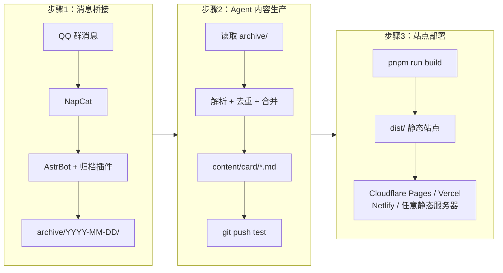

网站 UI 设计基于 @Sallyn0225 的 [gemini-rss-app](https://github.com/Sallyn0225/gemini-rss-app)，谢谢佬的无私开源！

# EDU-PUBLISH

EDU-PUBLISH 是一个依赖 AstrBot 插件 [astrbot-QQtoLocal](https://github.com/guiguisocute/astrbot-QQtoLocal) 以及各类 Agent（Claude Code、OpenCode、Codex…）自动分析整理的**通用高校通知聚合站模板**。致力于解放高校班委的转发压力，以及打破学院之间的信息差。

支持 PWA / RSS / 暗色模式 / 搜索 / 筛选 / 日历 / AI 摘要。部署平台无关——Cloudflare Pages、Vercel、Netlify 或任意静态服务器均可。


---

## 整体架构

整套系统分三段，各自独立，可以只跑其中一段。



### 第一段：消息桥接

用 Docker 跑两个容器，把 QQ 群消息落盘到本地 `archive/` 目录：

- **NapCat**：QQ 协议层，负责收发消息
- **AstrBot + 归档插件**：接收 NapCat 转发的消息，按日期写入 `archive/YYYY-MM-DD/messages.md`

两个容器通过 Docker 网络互通。`archive/` 由插件持续写入，主仓库只读取不修改。宿主机支持 Linux、macOS 或 Windows（通过 WSL）。

### 第二段：Agent 内容生产

Agent（AI 或人工）在项目目录里工作：

1. 读取 `archive/` 中的新消息
2. 按规则解析、去重、合并
3. 生成结构化卡片到 `content/card/<school_slug>/`
4. 写每日总结到 `content/conclusion/`
5. 校验通过后 push 到 `test` 分支

Agent 只改 `content/` 和 `worklog/`，不碰配置和代码。详细规则见 `BOT_RULES.md`。

### 第三段：站点部署

构建产物为纯静态站点（`dist/`），不依赖特定平台。可选部署方式：

| 方式 | 说明 |
|------|------|
| **Cloudflare Pages Git 直连**（推荐） | 在 CF Dashboard 关联 Git 仓库，push 自动触发构建，零 CI 配置 |
| **GitHub Actions + wrangler** | 使用仓库内置 workflow，适合需要自定义 CI 步骤的场景 |
| **Vercel / Netlify / GitHub Pages** | 标准 Node.js 静态站点，通用配置即可 |
| **手动部署** | `pnpm run build` 后把 `dist/` 扔到任意静态服务器 |

---

## 部署

### Agent 引导部署（推荐）

适合从零开始搭建完整链路：

1. 在 GitHub 网页端 fork `guiguisocute/EDU-PUBLISH`
2. clone 到本地
3. 在项目根目录让 agent 执行：`阅读 .agent/SETUP.md 并按步骤执行`
4. agent 会依次完成：skill 安装 → Docker 环境检查 → NapCat + AstrBot 部署 → 插件配置 → 消息链路验证
5. 本地链路跑通后，agent 会询问是否继续部署网页（参见 `.agent/PUBLISH.md`）

相关文件：`.agent/SETUP.md`（主入口）→ `.agent/PUBLISH.md`（可选网站发布）→ `.agent/SKILLS.md`（skill 安装）

### Cloudflare Pages Git 直连（推荐）

最简单的发布方式，无需 GitHub Actions：

1. 在 [Cloudflare Dashboard](https://dash.cloudflare.com) → `Workers & Pages` → `Create` → 关联 Git 仓库
2. 构建配置：Build command `pnpm run build`，Output directory `dist`
3. 环境变量：`NODE_VERSION` = `22`，`SITE_URL` = 站点域名

push 即部署，非生产分支自动生成预览 URL。

### GitHub Actions + Cloudflare Pages

需要自定义 CI 步骤时使用。在仓库 `Settings` → `Secrets` 中配置：

| Secret | 说明 | 必填 |
|--------|------|:---:|
| `CLOUDFLARE_PROJECT_NAME` | Pages 项目名 | 是 |
| `CLOUDFLARE_API_TOKEN` | API Token | 是 |
| `CLOUDFLARE_ACCOUNT_ID` | Account ID | 是 |
| `CLOUDFLARE_PAGES_URL` | 生产域名 | 是 |
| `CLOUDFLARE_PAGES_TEST_URL` | 测试预览域名 | 是 |

详细格式参见 `.github/secrets.template.md`。

如果当前仓库不打算使用 GitHub Actions 部署，可以在 `config/site.yaml` 中设置：

```yaml
github_actions_enabled: false
```

这样内置的 `deploy.yml` 和 `deploy-main.yml` 在触发后会直接跳过部署 job，不会因为缺少 Cloudflare Secrets 而持续报错通知。

### 其它静态平台

通用配置适用于 Vercel、Netlify、GitHub Pages 等：

| 配置项 | 值 |
|--------|-----|
| Build command | `pnpm run build` |
| Output directory | `dist` |
| Node.js version | `22` |
| Install command | `pnpm install` |

环境变量：`SITE_URL` 设为站点域名。

### 手动部署

1. **消息桥接**：Docker 部署 [NapCat](https://github.com/NapNeko/NapCat-Docker) + [AstrBot](https://github.com/Soulter/AstrBot)，安装归档插件 [astrbot-QQtoLocal](https://github.com/guiguisocute/astrbot-QQtoLocal)，配置插件的 `archive_root` 指向项目的 `archive/` 目录
2. **archive 目录**：`archive/` 由 AstrBot 插件持续写入归档数据，`.gitignore` 已忽略其运行时内容
3. **Agent 内容生产**：在项目目录运行 agent，读取 `archive/` 生成卡片到 `content/card/`，push `test` 分支
4. **站点构建**：`pnpm install && pnpm run build`，`dist/` 是标准 SPA，部署时配 fallback 到 `index.html`

各段可独立运行。只想看前端效果可以跳过桥接，`node scripts/generate-demo-content.mjs` 生成 demo 内容后直接 build。

### S3 兼容对象存储（可选）

对象存储**不是必需的**。未配置时，所有附件和图片直接从静态产物中提供服务。超过平台单文件上限（如 CF Pages 25MB）的附件会被自动跳过并警告。

当内容量增长需要外部存储时，可启用任何 S3 兼容服务（AWS S3、Cloudflare R2、MinIO、Backblaze B2 等）。在 `.env` 或平台环境变量中配置：

| 变量 | 说明 |
|------|------|
| `S3_BUCKET` | Bucket 名称 |
| `S3_ENDPOINT` | S3 兼容 endpoint URL |
| `S3_ACCESS_KEY_ID` | Access Key |
| `S3_SECRET_ACCESS_KEY` | Secret Key |
| `S3_PUBLIC_BASE_URL` | 对外访问基础 URL |
| `ATTACHMENT_UPLOAD_THRESHOLD_MB` | 超过此大小的附件上传到 S3（默认 20MB） |

缺少任一配置项时，构建脚本会静默跳过，不影响正常构建。参见 `.env.example`。

### 浏览量统计（可选）

站点支持可选的浏览量统计，通过 `ViewStore` 接口实现，可扩展接入不同数据库后端。

- **Cloudflare D1**（内置支持）：在 Pages 项目中绑定 D1 数据库（Binding: `DB`），schema 会在首次请求时自动创建
- **其它数据库**：`functions/lib/view-store.ts` 提供了 `ViewStore` 接口，可扩展实现 PostgreSQL、MySQL 等后端
- **未绑定数据库**时自动降级为无统计模式，不影响站点正常使用

---
## 快速开始

```bash
# 环境要求：Node.js >= 22，pnpm
git clone https://github.com/your-org/edu-publish.git
cd edu-publish
pnpm install

# 编辑配置（见下方说明）
# config/site.yaml          — 站点品牌
# config/subscriptions.yaml — 订阅源
# config/widgets.yaml       — 功能开关

# 生成 Demo 内容（可选）
node scripts/generate-demo-content.mjs

# 开发
pnpm run dev          # http://localhost:3000

# 构建
pnpm run build        # 输出到 dist/
pnpm run preview      # 预览构建产物
```
---

## 配置文件

三个 YAML 文件控制整个站点，都在 `config/` 下。

### site.yaml — 站点品牌

```yaml
site_name: "EDU Publish"
site_short_name: "EDU Publish"
site_description: "高校通知聚合站"
site_url: "https://example.edu.cn"

organization_name: "示例大学"
organization_unit_label: "单位"    # UI 中对子级组织的显示用词

logo_light: "/img/logo-light.svg"
logo_dark: "/img/logo-dark.svg"
favicon: "/favicon.svg"
default_cover: "/img/default-cover.webp"

footer:
  copyright: "© 2025 示例大学"
  links:
    - label: "GitHub"
      url: "https://github.com/your-org/your-repo"

seo:
  title_template: "{page} - {site_name}"
  default_keywords: ["高校通知", "校园信息"]

github_actions_enabled: true   # 设为 false 可跳过仓库内置 GitHub Actions 部署

palette:
  preset: "blue"       # red | blue | green | amber | custom
```

### subscriptions.yaml — 订阅源与分类

```yaml
# 通知分类枚举（Bot 生成 category 字段时从此列表选取）
categories:
  - 通知公告
  - 竞赛相关
  - 志愿实习
  - 二课活动
  - 问卷填表
  - 其它分类

schools:
  - slug: info-engineering
    name: 信息工程学院
    short_name: 信工
    order: 1
    icon: /img/unit-icon-info-engineering.svg
    subscriptions:
      - title: 学院通知
        enabled: true
        order: 1
```

### widgets.yaml — 功能开关

```yaml
modules:
  dashboard: true         # 数据看板
  right_sidebar: true     # 右侧栏（日历、标签、AI 摘要）
  search: true            # 搜索
  view_counts: false      # 浏览量（需 D1 后端）
  stats_chart: true       # 统计图表
  pwa_install: true       # PWA 安装按钮
  footer_branding: true   # 页脚

widgets:
  palette_switcher:
    enabled: true          # 色相滑块
  calendar:
    enabled: true
  ai_summary:
    enabled: true
```

---

## 构建命令

```bash
pnpm run dev               # 开发模式（自动编译配置和内容）
pnpm run build             # 完整构建（自动执行 validate → compile → content → images → rss → vite）
pnpm run preview           # 预览构建产物

pnpm run validate          # 校验配置文件（JSON Schema）
pnpm run compile:config    # 编译 site.yaml + widgets.yaml → public/generated/
pnpm run build:content     # 编译卡片 → content-data.json
pnpm run build:rss         # 生成 RSS
```

---

## 卡片格式

每张通知卡片是 `content/card/<school_slug>/` 下的 Markdown 文件。

```yaml
---
id: "20260213-info-engineering-01"
school_slug: "info-engineering"
title: "关于智慧团建系统各专题学习录入的通知"
description: >-
  智慧团建系统上线"贺信精神"等多个专题学习。各团支部需组织团员学习
  并于本周五19:00前完成录入。
published: 2026-02-13T12:54:54+08:00
category: "通知公告"
tags: ["智慧团建", "理论学习"]
start_at: "2026-02-13T00:00:00+08:00"
end_at: "2026-02-13T19:00:00+08:00"
source:
  channel: "学院通知"
  sender: "教务处"
attachments: []
---

通知正文（Markdown）...
```

必填字段：`id`、`school_slug`、`title`、`description`（`>-` 语法）、`published`（ISO8601 `+08:00`）、`source.channel`、`source.sender`。

完整字段说明见 `BOT_RULES.md` 第 5 节。

---

## 技术栈

| 层 | 技术 |
|---|------|
| 前端 | React 19 + TypeScript + Vite 6 + Tailwind CSS |
| UI 组件 | Radix UI + shadcn/ui + Framer Motion |
| 图表 | Recharts |
| 内容编译 | Node.js 脚本（gray-matter + marked + yaml） |
| 图片优化 | sharp（纯 Node.js，无系统依赖） |
| 配置校验 | AJV (JSON Schema 2020-12) |
| 浏览计数 | ViewStore 接口（内置 D1 支持，可扩展） |
| 对象存储 | S3 兼容（可选，支持任意 S3 兼容服务） |
| 消息桥接 | NapCat + AstrBot (Docker) |

## RSS

- 全站：`/rss.xml`
- 按单位：`/rss/<school_slug>.xml`

## License

[MIT](./LICENSE)
